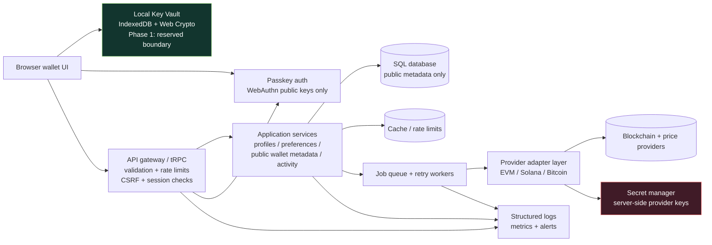

# Trustee Wallet Web — Phase 1 Architecture & Security Plan

**Status:** Planning baseline confirmed  
**Current checkpoint:** `b3da467f`  
**Date:** 2026-09-26  
**Custody decision:** **Non-custodial by default**  
**Authentication decision:** **Do not use Manus OAuth**

> This document defines the first production-oriented foundation stage. It is an implementation plan and security baseline, not a claim that the current prototype is production-ready.

---

## 1. Current prototype confirmation

### Confirmed state

- The current project is `trustee-wallet-web`, a Vite + React + TypeScript + Tailwind static frontend.
- The prototype is visually complete and responsive across desktop and mobile breakpoints.
- Implemented surfaces include:
  - Portfolio overview and balance chart
  - Asset cards, asset search, watchlist UI, and market pulse
  - Send and receive modal flows
  - Swap quote interaction
  - Buy crypto UI
  - Activity ledger
  - Settings and local preference toggles
  - Desktop sidebar and mobile bottom navigation
- The dev server is healthy and the preview is available through the WebDev project.
- TypeScript validation and the production build passed before this plan was started.
- Browser smoke testing confirmed navigation and the Send modal flow.
- The current UI uses hardcoded demo data and does **not** read blockchain, market, transaction, or provider APIs.
- No recovery phrase, private key, seed, or signed transaction is currently handled.

### OAuth audit

The active wallet UI does not invoke Manus OAuth. The scaffold still contains template-only artifacts that must be removed during the foundation migration:

- `client/src/const.ts` contains a Manus OAuth URL helper.
- `client/src/components/ManusDialog.tsx` contains a Manus login dialog.
- `.project-config.json` contains Manus OAuth environment metadata.
- The generated scaffold includes Manus runtime/template references that are not part of the wallet custody model.

**Action:** remove these artifacts and do not migrate Manus OAuth into the full-stack foundation.

### Explicit non-goals for Phase 1

Phase 1 will not:

- Create or import recovery phrases
- Derive private keys
- Sign or broadcast transactions
- Integrate real swaps or fiat on-ramp
- Store wallet secrets in the database
- Process payment card or bank data
- Claim mainnet production readiness

Those capabilities depend on the security boundary established here and belong to later gated workstreams.

---

## 2. Architecture principles

1. **Keys stay on the user device.** The backend receives only public wallet metadata and, later, already-signed transactions.
2. **The backend is an indexer and coordination layer, not a custodian.** It must never be able to reconstruct a wallet or sign on behalf of a user.
3. **No Manus OAuth.** Authentication for backend metadata is provider-neutral and app-controlled.
4. **Separate identity from custody.** A user account may sync preferences and public activity, but account authentication must not unlock wallet keys.
5. **No secret in logs, analytics, crash reports, URLs, or database rows.** This includes recovery phrases, private keys, raw signed payloads where avoidable, access tokens, and payment data.
6. **Read-only first.** Phase 1 proves authenticated metadata access and provider isolation before any signing path is introduced.
7. **Fail closed for security decisions.** Unknown chain, token, recipient, domain, provider, or session state must block the sensitive operation.
8. **Every mutation is idempotent and auditable.** Retries must not create duplicate wallet records, activities, or broadcast attempts.
9. **Environment isolation is mandatory.** Development, staging, and production use distinct databases, provider keys, cookies, domains, and telemetry.
10. **Security review is a release gate, not a final polish step.**

---

## 3. Proposed target architecture



### Trust boundaries

| Boundary | Data crossing it | Required controls |
|---|---|---|
| Browser ↔ API | Session cookie, public metadata requests, later signed payloads | Same-origin policy, TLS, CSRF protection, schema validation, rate limits |
| Browser ↔ local key vault | Recovery phrase/private key in later phases | Web Crypto, passcode-derived key, memory minimization, no telemetry, explicit lock state |
| API ↔ database | User/account/public wallet metadata/activity | Least-privilege DB role, row ownership checks, encryption at rest, migrations |
| API ↔ providers | Public addresses, chain queries, provider credentials | Server-side secrets, adapter allowlist, timeouts, circuit breakers, redaction |
| Workers ↔ providers | Public addresses and cursors | Scoped credentials, bounded retries, replay protection, provider isolation |
| Application ↔ observability | Operational metadata | Structured redaction, no payload/secret logging, retention limits |

---

## 4. Authentication and session design without Manus OAuth

### Recommended Phase-1 model

Use **WebAuthn passkeys** for authenticating the application account that owns public wallet metadata and preferences. This is separate from the local wallet vault.

- The server stores only WebAuthn credential IDs, public keys, counters, transports, and user metadata.
- The server never receives a recovery phrase, private key, wallet encryption key, or passcode.
- A passkey login unlocks the user’s application account, not the wallet vault.
- A local wallet lock/passcode remains an independent client-side control.
- A recovery phrase is never treated as an account password.

If passkeys are unavailable on a target platform, defer account sync rather than introducing a weak password fallback. An optional email magic-link fallback can be added later only after abuse controls, email ownership guarantees, session binding, and account-recovery policy are reviewed.

### Session controls

- Use short-lived, rotating, opaque server sessions.
- Store only a hash of the session identifier server-side.
- Set cookies with:
  - `HttpOnly`
  - `Secure`
  - `SameSite=Lax` or `Strict` depending on deployment flows
  - narrow `Path`
  - explicit expiration
- Rotate the session after passkey authentication and privilege changes.
- Revoke sessions on logout, suspected abuse, credential removal, and account recovery.
- Maintain a per-user session list with device label, created time, last seen time, and revocation state.
- Do not store auth tokens in `localStorage`.
- Bind sensitive mutations to a CSRF token and same-origin checks.
- Require recent re-authentication for account security changes.

### Manus OAuth removal checklist

- Delete `client/src/const.ts` OAuth helper; keep only a neutral shared session constant in `shared/const.ts` for the future provider-neutral session layer.
- Remove `client/src/components/ManusDialog.tsx` if unused.
- Remove `VITE_OAUTH_PORTAL_URL`, `OAUTH_SERVER_URL`, and related auth variables from the application environment contract.
- Remove OAuth callback routes and references from the full-stack scaffold.
- Remove any Manus-auth-specific procedures and context assumptions; do not reuse the scaffold's Manus cookie contract.
- Keep WebDev platform/runtime metadata only where required for hosting; do not expose it as application authentication.
- Add a CI grep rule that fails on `oauth`, `manus`, `VITE_OAUTH`, and `OAUTH_SERVER_URL` in application-owned source/config, with an explicit allowlist for platform tooling if needed.

---

## 5. Full-stack project shape

Use a full-stack React + Express + tRPC + Drizzle foundation, but do **not** adopt its built-in Manus OAuth path.

```text
client/
  src/
    pages/
    components/
    contexts/
    lib/trpc.ts
    lib/auth.ts              # passkey client helpers only
    lib/key-vault.ts         # Phase 1 boundary, no secret implementation yet
server/
  auth/
    passkeys.ts              # WebAuthn registration/authentication
    sessions.ts              # opaque session lifecycle
  db.ts
  routers.ts
  services/
    wallet-metadata.ts
    provider-gateway.ts
    activity-indexer.ts      # skeleton in Phase 1
  middleware/
    csrf.ts
    rate-limit.ts
    request-context.ts
  observability/
    logger.ts
    redaction.ts
  _core/                     # retain only hosting/runtime primitives required
  index.ts
driz​zle/
  schema.ts
  migrations/
shared/
  contracts.ts               # zod/tRPC-safe public DTOs
  chains.ts                  # allowlisted chain/network definitions
  errors.ts                  # stable error codes
```

### API contract approach

- Use tRPC procedures as the typed application contract.
- Validate every input with Zod at the procedure boundary.
- Return allowlisted DTOs, not raw provider responses.
- Never pass database rows directly to the browser when they contain internal fields.
- Use stable error codes such as `UNAUTHENTICATED`, `FORBIDDEN`, `RATE_LIMITED`, `PROVIDER_UNAVAILABLE`, and `STALE_DATA`.
- Require idempotency keys for all future mutating procedures.
- Keep read-only procedures cacheable where safe.

### Initial procedure groups

| Procedure group | Phase-1 status | Notes |
|---|---:|---|
| `auth.passkeyRegisterBegin` | Build | Returns challenge only; persist challenge server-side with short TTL |
| `auth.passkeyRegisterFinish` | Build | Stores public credential data; creates rotated session |
| `auth.passkeyLoginBegin` | Build | Challenge is single-use and bound to session/browser context |
| `auth.passkeyLoginFinish` | Build | Counter and origin checks required |
| `auth.sessions` | Build | List/revoke current user’s sessions |
| `profile.me` | Build | Minimal profile metadata only |
| `wallets.listPublic` | Build | Public addresses, chain IDs, labels, watch state |
| `wallets.addPublicAddress` | Build | Validate checksum/network; no secrets |
| `wallets.removePublicAddress` | Build | Ownership + CSRF + idempotency |
| `activity.list` | Skeleton | Reads indexed public activity only |
| `sync.status` | Skeleton | Provider/indexer health and last successful cursor |
| `signing.*` | Forbidden in Phase 1 | Must not exist until the signing architecture passes review |

---

## 6. Database design — public metadata only

### Core tables

| Table | Purpose | Sensitive data allowed? |
|---|---|---|
| `users` | App account identity and status | No secrets; passkey-linked metadata only |
| `passkey_credentials` | WebAuthn credential ID, public key, counter, transports | Public key only; no private credential material |
| `sessions` | Hashed opaque session ID, user ID, expiry, revocation | Hashes only; never raw session token |
| `wallets` | User wallet labels and status | No seed, private key, or encryption key |
| `wallet_accounts` | Account index, chain, public address, checksum form | Public addresses only |
| `watched_assets` | User asset/watchlist preferences | Public market metadata only |
| `indexed_transactions` | Normalized chain activity | Public blockchain data only |
| `provider_sync_cursors` | Provider/network cursor and status | No provider secret; cursor must be redacted if sensitive |
| `notification_preferences` | Alert preferences and channels | No secrets; email/push IDs require separate policy |
| `audit_events` | Security and administrative events | Redacted metadata only |
| `idempotency_keys` | Deduplicate mutations | Request fingerprint, status, expiry only |

### Explicitly forbidden columns and payloads

Do not add fields named or equivalent to:

- `seed_phrase`, `mnemonic`, `recovery_phrase`
- `private_key`, `secret_key`, `xprv`, `keystore_password`
- `wallet_encryption_key`
- `passcode`, `pin`
- `raw_signed_transaction` unless a later reviewed design requires short-lived storage
- Provider API keys or webhook signing secrets

Use schema review and CI checks to prevent accidental introduction of these names.

---

## 7. Phase-1 security controls

### Application controls

- Strict input validation on every API procedure.
- Authorization checks scoped to the authenticated user on every row access.
- Explicit allowlists for chains, networks, token contracts, and provider routes.
- No dynamic provider URL construction from user input.
- SSRF protection for all server-side outbound requests.
- Timeouts, bounded retries, circuit breakers, and response-size limits for providers.
- Idempotency keys on mutations.
- Pagination limits and query complexity limits.
- Same-origin CORS policy; no wildcard origins in production.
- CSRF token for cookie-authenticated state changes.
- Content Security Policy with `default-src 'self'`; narrowly reviewed exceptions for required providers.
- Trusted Types or an equivalent DOM XSS prevention strategy before wallet signing UI is enabled.
- Avoid `dangerouslySetInnerHTML`; sanitize any provider-returned rich text.
- Dependency lockfile, secret scanning, SAST, and dependency vulnerability scanning in CI.

### Wallet boundary controls

Even though key handling is deferred, reserve the boundary now:

- `key-vault.ts` must expose a narrow interface, not raw storage access.
- The UI must never use a recovery phrase as a React state value beyond the minimum flow required later.
- Never send key-vault values through tRPC, analytics, error reporting, clipboard telemetry, or URL parameters.
- Add a `sensitive`/`no-record` boundary around future recovery and signing screens.
- Do not implement mock private keys that could be mistaken for production key handling.
- Add a visible demo-mode guard until testnet signing exists.

### Logging and monitoring

Log only:

- Request ID, route/procedure name, status code, latency, environment
- User/account ID hash or internal ID where necessary
- Provider name, chain, network, and normalized error code
- Session lifecycle events without raw tokens
- Security events such as repeated failures, passkey changes, CSRF failures, and rate-limit blocks

Never log:

- Recovery phrases, private keys, passcodes, raw cookies, authorization headers
- Full wallet payloads when addresses are not needed
- Full signed transaction blobs unless explicitly approved for a short-lived operational workflow
- Payment details or on-ramp KYC data

### Rate limits

Initial limits should be configurable per environment and tuned from telemetry:

| Surface | Baseline control |
|---|---|
| Passkey begin/finish | Per IP + per account + per device; strict burst limit |
| Public address add/remove | Per account and IP; require CSRF and idempotency |
| Provider proxy | Per account + provider + chain; cache reads |
| Sync jobs | Per wallet address + chain; bounded concurrency |
| Session listing/revocation | Per account; re-auth for broad revocation |
| Error-prone requests | Progressive backoff and abuse flagging |

---

## 8. Threat model and risk matrix

| Threat | Impact | Likelihood | Phase-1 mitigation | Residual risk / gate |
|---|---:|---:|---|---|
| Manus OAuth accidentally reintroduced | High | Medium | Remove helpers/envs; CI grep; custom auth context | Review scaffold diff before merge |
| Recovery phrase reaches backend | Critical | Low in Phase 1, high later | No key flows; DTO allowlists; network egress tests | Mandatory key-management audit |
| XSS steals local vault material | Critical | Medium | CSP, Trusted Types plan, no unsafe HTML, dependency scanning | Independent frontend security review |
| Session theft | High | Medium | HttpOnly secure cookies, rotation, revocation, CSRF, TLS | Pen test and incident drill |
| IDOR exposes another user’s addresses | High | Medium | Ownership predicates, authorization tests, opaque IDs | Security regression suite |
| Provider API key leakage | High | Medium | Server-only secret manager, redaction, no VITE secret vars | Secret scanning in CI/CD |
| Provider SSRF / malicious URL | High | Low | Fixed adapter URLs, allowlist, no arbitrary fetch | External review of adapter layer |
| Replay/duplicate mutation | Medium | Medium | Idempotency keys, unique DB constraints | Failure-injection tests |
| Stale or manipulated provider data | High | Medium | Source labels, timestamps, quorum/consistency checks later | Data-integrity review before transactions |
| Chain reorg causes incorrect activity | Medium | Medium | Confirmation status model, reorg-aware indexer design | Testnet reorg tests |
| Rate-limit exhaustion / provider abuse | Medium | High | Per-user/IP/provider limits, cache, circuit breakers | Capacity test in staging |
| Supply-chain compromise | Critical | Low/Medium | Lockfile, provenance, SCA, minimal dependencies | Release signing and review |
| Browser extension/phishing manipulation | Critical | Medium | Origin display, known-domain warnings, transaction simulation later | Signing UX audit |
| Accidental secret logging | Critical | Medium | Redaction middleware, log tests, forbidden-field checks | Production log sampling |

### Security severity policy

- **Critical:** blocks all wallet secret or signing work; requires remediation and review.
- **High:** blocks mainnet transactions and public beta; may allow read-only staging.
- **Medium:** must have owner and mitigation before staging; does not automatically block mocked UI.
- **Low:** backlog with rationale and monitoring.

---

## 9. Sequenced Phase-1 implementation plan

### Stage 1 — Remove inherited authentication and define contracts

**Deliverables**

- Remove Manus OAuth helper/dialog/env contract from application-owned code.
- Define custom auth/session interfaces.
- Define public-only shared DTOs and error codes.
- Add CI checks for secret-like fields and forbidden OAuth references.
- Decide production domains and environment naming.

**Acceptance criteria**

- No application route redirects to Manus OAuth.
- No client bundle contains OAuth portal or provider secrets.
- `rg -n` security scan passes with only documented platform allowlist hits.
- TypeScript and build checks remain green.

**Rollback**

- Revert only the auth-removal commit; do not restore OAuth behavior. If migration is blocked, keep the current demo UI static while resolving the custom auth implementation.

### Stage 2 — Create full-stack foundation

**Deliverables**

- Upgrade the project to the full-stack WebDev scaffold or equivalent Express/tRPC/Drizzle structure.
- Add environment schema and startup validation.
- Add database migrations and least-privilege database access.
- Add request ID, error boundary, structured logger, redaction middleware, and health endpoints.
- Add provider adapter interface with no live provider credentials yet.

**Acceptance criteria**

- Dev, staging, and production configs are isolated.
- App starts with missing optional providers but fails closed on missing required secrets.
- Health endpoint reports database and queue readiness without leaking configuration.
- No secrets are available through `VITE_*` variables.

**Rollback**

- Keep the static frontend checkpoint `b3da467f` available as the visual fallback while the backend foundation is isolated behind feature flags.

### Stage 3 — Add passkeys and sessions

**Deliverables**

- WebAuthn registration/login.
- Session creation, rotation, listing, and revocation.
- CSRF protection and same-origin checks.
- Account ownership and authorization middleware.
- Security event audit records.

**Acceptance criteria**

- A passkey can register and authenticate in staging.
- Session cookies are HttpOnly/Secure/SameSite and opaque.
- Replayed challenges fail.
- Credential counters and origin checks are enforced.
- Cross-user access tests fail closed.

**Rollback**

- Disable account sync routes with a feature flag and preserve read-only demo mode. Do not introduce a password fallback during rollback.

### Stage 4 — Public wallet metadata and read-only sync skeleton

**Deliverables**

- Add wallets/accounts tables containing public addresses only.
- Add address validation and checksum normalization.
- Add provider adapter contracts, cache, cursor, and job status models.
- Add mocked provider adapter for deterministic tests.
- Add user-visible stale/sync status.

**Acceptance criteria**

- Users can add/remove a public address after authentication.
- No seed/private-key fields exist in the schema or network requests.
- Mocked balances/activity render through tRPC with cache and stale-state handling.
- Provider outages do not crash the app.

**Rollback**

- Disable live sync adapters and return mocked/demo data with a clear label.

---

## 10. Testing and verification gates

### Required before Phase 1 completion

- `pnpm check`
- `pnpm build`
- Unit tests for authorization predicates, session rotation, CSRF, rate limits, validation, and redaction.
- Integration tests for database migrations and idempotency.
- WebAuthn test vectors and replay tests.
- E2E tests for registration, login, logout, session revocation, add public address, and cross-user denial.
- Secret scanning and dependency scanning.
- Browser tests at desktop and mobile breakpoints.
- Network interception tests proving no forbidden fields leave the browser.
- Log snapshot tests proving secrets and auth headers are redacted.
- Staging deployment smoke test with production secrets absent.

### Required before any key-handling work

- Threat model review.
- Independent review of the local key-vault design.
- Recovery-phrase handling test plan.
- XSS/CSP/Trusted Types verification.
- Browser-extension and phishing UX review.
- Explicit approval of the custody/signing design.

---

## 11. Environment and deployment plan

| Environment | Purpose | Data | Domain/cookies | Provider access |
|---|---|---|---|---|
| Development | Local feature work | Synthetic only | Local origin; dev cookie | Mock providers by default |
| Staging | Shared verification | Non-sensitive test accounts | Dedicated staging origin | Testnets/sandbox providers |
| Production | Public service | Real public metadata | Dedicated production origin | Mainnet read-only initially |

### Secret handling

- Store server provider keys in the platform secret manager or equivalent, never in Git or client bundles.
- Maintain separate keys per environment.
- Rotate keys on a documented schedule and after any suspected exposure.
- Fail CI if secrets appear in source, generated client assets, or logs.
- Never place secrets in `.env` committed to the repository.

### Release controls

- Protected main branch.
- Required typecheck, build, test, SAST, SCA, and secret scan checks.
- Review required for schema/auth/security changes.
- Migration forward and rollback plan documented per release.
- Feature flags for provider adapters and every write-capable capability.

---

## 12. Decision log

### ADR-001 — Non-custodial custody model

**Decision:** Wallet keys remain on the user device. The backend stores public metadata only and later accepts signed payloads, never unsigned key material.

**Why:** Minimizes server compromise impact, aligns with Trustee-style product expectations, and keeps signing authority with the user.

**Cascading effects:**

- Wallet creation/import must run locally.
- Account authentication cannot replace wallet unlock.
- Backend cannot recover a lost wallet.
- Transaction UI must show exactly what is signed.
- Recovery UX and security messaging are core product features.
- Legal/compliance posture differs from a custodial exchange but still requires jurisdiction-specific review.

### ADR-002 — No Manus OAuth

**Decision:** Do not use Manus OAuth for application authentication.

**Replacement:** Provider-neutral WebAuthn passkeys for optional backend account identity, with opaque application sessions. The wallet itself can operate locally without an account; account sync is a separate opt-in capability.

**Why:** Removes an inherited platform dependency and keeps the authentication boundary explicit, portable, and independent from custody.

### ADR-003 — Full-stack foundation before live chain writes

**Decision:** Establish API, database, auth, observability, and provider isolation before implementing wallet signing or mainnet mutation.

**Why:** The highest-risk failures are architectural and security failures, not UI failures. Read-only and mocked providers enable incremental verification.

---

## 13. Phase-1 completion definition

Phase 1 is complete only when all of the following are true:

- The project is full-stack with an explicitly documented API, database, and worker boundary.
- Manus OAuth has been removed from application code and environment contracts.
- Passkey registration/login and secure sessions work in staging, or account sync is explicitly disabled while local-only mode remains functional.
- Database schema contains public wallet metadata only.
- No recovery phrase, private key, passcode, or signing material can reach the backend or observability stack.
- Provider credentials remain server-side and are isolated by environment.
- Rate limiting, validation, CSRF, authorization, structured logging, redaction, and health checks are verified by automated tests.
- Read-only/mock provider adapters work with cache, stale-state, retries, and outage handling.
- The original UI remains usable as the frontend shell and demo fallback.
- Remaining risks are documented with owners and release gates.

**Next implementation stage after this plan:** Stage 1 — remove inherited OAuth artifacts and establish the no-secret application contracts. No genuine user decision is required to begin that stage under the decisions recorded above.
